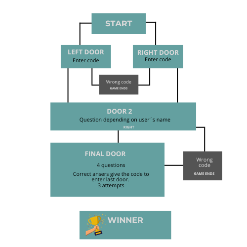

"Math Adventure: Museum Escape" is an engaging text-based app where users find themselves trapped in a museum, and the only way to escape is by solving riddles and math-related questions. The game is divided into four stages, each stage representing a different area or room in the museum. The goal is to reach the final door and enter a four-digit code to unlock it. If the user answers a question incorrectly, they may be given a chance to try again.

"Math Adventure: Museum Escape" is LIVE: https://camillapp3-96293dfa06b1.herokuapp.com/

## Table of Contents
+ [UX](#ux "UX")
  + [Site Purpose](#site-purpose "Site Purpose")
  + [Site Goal](#site-goal "Site Goal")
  + [Audience](#audience "Audience")
  + [Communication](#communication "Communication")
  + [Current User Goals](#current-user-goals "Current User Goals")
  + [New User Goals](#new-user-goals "New User Goals")
+ [Design](#design "Design")
+ [Features](#features "Features")
  + [Existing Features](#existing-features "Existing Features")
+ [Testing](#testing "Testing")
  + [Validator Testing](#validator-testing "Validator Testing")
  + [Unfixed Bugs](#unfixed-bugs "Unfixed Bugs")
+ [Technologies Used](#technologies-used "Technologies Used")
  + [Main Languages Used](#main-languages-used "Main Languages Used")
  + [Frameworks, Libraries & Programs Used](#frameworks-libraries-programs-used "Frameworks, Libraries & Programs Used")
+ [Deployment](#deployment "Deployment")
+ [Credits](#credits "Credits")
  + [Content](#content "Content")
  + [Media](#media "Media")

## UX

### Site Purpose:
This app allows the user to practise math in a fun and engaging way. 
The game integrates with the user by asking questions and basing the game plan on its answers.

### Site Goal: 
I got the idea for the app when I was sitting with my 13-year-old son's homework in math. 
Every math homework is a struggle and he really doesn't like the subject.
Therefore, I thought, that if I can make an app with customized numbers, it might be more fun.

### Audience:
The app is for children who want to practice math and who want to get excited about the subject of mathematics

### Communication:
The app prompts the user to go through the available options and make their choices. Different colors make it easier to read the different challenges.

### Current User Goals:
The goal is to engage the user to came to the last level with fun challenges and choices. Since it is different questions every time - the user can came back to solve new challenges. 

### New User Goals:
To pick new recipes to try, based on the user ratings provided by the previous user.

### Future Goals:
The app can expand easy, middle and hard levels. The game can also expand with different type of math problem such as: geometry and algebra.

## Design

### Wireframes:

## Features

### Existing Features:

#### Landing Page:

#### Retrieve or Rate a Recipe:

#### Submit Rating:

#### Restart or Quit app:

### Features Left to Implement
- Allow users to submit their own recipes.
- Create a feature to enable a user to increase the recipe size if they wish to make a multi-layered cake, and multiply the recipe based on the number of layers a user has selected.
- Add an additional feature to then allow the user to also increase the size of the cake tin they are using (e.g. 20cm, 25cm, 30cm etc), and adjust the ingredients list accordingly to accommodate for the increase in batter needed.
- Add additional recipes to choose from.
- A comments section, that would allow the user to expand on the reason for which they chose their previously inputted rating.

## Testing
In trying to create a function to allow the user to select from one of the recipe titles to rate, I was unable to pass in an argument in order to cycle through the list already generated in a previous function. Upon removing the argument, I saw the print statement was being logged to the console twice. I then realised that this was because the function was being called twice. Once through the user input function prompting the user to make a choice, and the second time from the main function. By removing the "submit_rating" function from the main function, I resolved my error message.

A new issue arose when it came to assign those ratings into the appropriate column for the recipe. As I could not discover the method to append a new cell to the end of a single column, I was instead guided by my friend Nick to create a list, so that I could just append an entirely new row to all the columns, inserting empty strings into the cells that did not need to be updated. 

This presented two new issues. One, it affected my ratings calculations. This issue was resolved when Nick showed me how to change the calculations so that empty cells were not factored in. 

And issue two arose when I tried to append the new array to a new row, an error message kept arising. Upon further inspection, I realised the error was that the inputed ratings were being generated into an empty array themselves, and thus I had a list, nested within a list, which led to the errors I was seeing. I resolved this by calling upon the indexed value of the item within the list.

### Validator Testing
- The code has been tested by using [PEP8 Online](http://pep8online.com/).

### Unfixed Bugs

## Technologies Used
### Main Languages Used
- Python

### Frameworks, Libraries & Programs Used
- GitPod - to create my html files & styling sheet before pushing the project to Github.
- GitHub - to store my repository for submission.
- Lucid - to create the mock up prior to beginning the project.
- Heroku - to deploy the live version of the terminal

## Deployment
The site was deployed to Heroku. The steps to deploy are as follows:
- log in to heroku
- create a new app
- navigate to settings
- add the following KEY/VALUE pairs:
- - CREDS + copy/paste data from creds.json file
- - PORT + 8000
- add build packs (in this order)
- - Python
- - nodejs
- go to GitPod terminal
- type the following commands into the terminal:
- - heroku login -i
- - enter in username + password
- - heroku apps
- - heroku git:remote -a my-app-name 
- - git add .
- - git commit -m "Deploy to Heroku cia CLI"
- - git push origin main
- - git push heroku main
- The live link can be found [HERE - Layer Cakes](https://layer-cakes.herokuapp.com/)
- * Site has been depolyed to [Render](https://render.com/), following these [instructions](https://code-institute-students.github.io/deployment-docs/10-pp3/).

## Credits

### Content
Support was provided by my fellow student & friend [Mats Simonsson](https://github.com/Pelikantapeten) by aiding me in bouncing off ideas & venting frustrations. They also provided immeasurable support when my brain was too tired to think straight, & helped me to work through my issues with a second set of eyes. I cannot thank them enough for being there for me.

Also a huge thank you to my mentor, Martina Terlevic who kept me calm when I was on the verge of panic. As well as taught me how to break my thinking down into bite-sized chunks that were easier to manage, instead of trying to figure it all out in one go.

The start of the project is based on the 'Love Sandwiches' walk through, and the three functions to obtain the column data & generate an average have been used in this project. They have been marked accordingly within the run.py file.

[StackOverflow](https://stackoverflow.com/questions/1663807/how-to-iterate-through-two-lists-in-parallel) reminded me how to iterate through two lists, and this was used to generate the recipe titles & user ratings together.

[StackOverflow](https://stackoverflow.com/questions/522563/accessing-the-index-in-for-loops) provided the reminder for how to index my 'for loop'.

[Mats Simonsson](https://github.com/Pelikantapeten) helped me to create my Try/Except statement, and walked me through their own code when I was stuck.

Nick Ludlam, my friend, assisted me in re-writing the code for the averages function, as it needed to account for empty cells being inserted into the submit rating function. They have been credited accordingly above the function as well.

The code for how to exit the application came from [Geeks for Geeks](https://www.geeksforgeeks.org/python-exit-commands-quit-exit-sys-exit-and-os-_exit/).

[Pretty Printed](https://www.youtube.com/watch?v=bu5wXjz2KvU) provided a great tutorial on manipulating google spreadsheets.

The information on how to iterate through three lists simultaneously came from [Geeks for Geeks](https://www.geeksforgeeks.org/python-iterate-multiple-lists-simultaneously/).

Instructions on adding (Termcolor)[https://pypi.org/project/termcolor/] came from [StackOverflow](https://stackoverflow.com/questions/51530437/no-module-named-termcolor).

### Media
Recipes used for the app were written by me.
