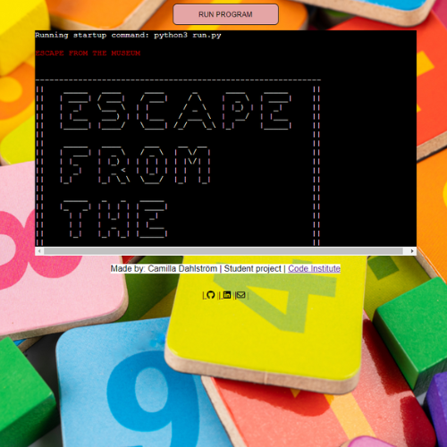
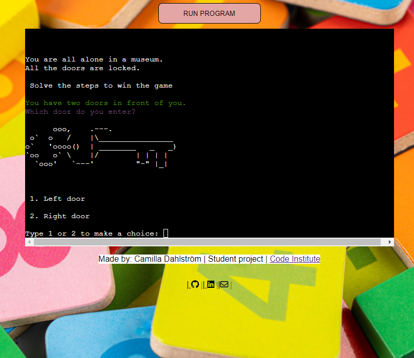

"Math Adventure: Museum Escape" is an engaging text-based app where users find themselves trapped in a museum, and the only way to escape is by solving riddles and math-related questions. The game is divided into four stages, each stage representing a different area or room in the museum. The goal is to reach the final door and enter a four-digit code to unlock it. If the user answers a question incorrectly, they may be given a chance to try again.

"Math Adventure: Museum Escape" is LIVE: https://camillapp3-96293dfa06b1.herokuapp.com/

## Table of Contents
+ [UX](#ux "UX")
  + [Site Purpose](#site-purpose "Site Purpose")
  + [Site Goal](#site-goal "Site Goal")
  + [Audience](#audience "Audience")
  + [Communication](#communication "Communication")
  + [Current User Goals](#current-user-goals "Current User Goals")
  + [New User Goals](#new-user-goals "New User Goals")
+ [Design](#design "Design")
+ [Features](#features "Features")
  + [Existing Features](#existing-features "Existing Features")
+ [Testing](#testing "Testing")
  + [Validator Testing](#validator-testing "Validator Testing")
  + [Unfixed Bugs](#unfixed-bugs "Unfixed Bugs")
+ [Technologies Used](#technologies-used "Technologies Used")
  + [Main Languages Used](#main-languages-used "Main Languages Used")
  + [Frameworks, Libraries & Programs Used](#frameworks-libraries-programs-used "Frameworks, Libraries & Programs Used")
+ [Deployment](#deployment "Deployment")
+ [Credits](#credits "Credits")
  + [Content](#content "Content")
  + [Media](#media "Media")

## UX

### Site Purpose:
This app allows the user to practise math in a fun and engaging way. 
The game integrates with the user by asking questions and basing the game plan on its answers.

### Site Goal: 
I got the idea for the app when I was sitting with my 13-year-old son's homework in math. 
Every math homework is a struggle and he really doesn't like the subject.
Therefore, I thought, that if I can make an app with customized numbers, it might be more fun.

### Audience:
The app is mainly for children and provides clear instructions and user prompts. I want to make it easy to understand what they need to do so they get excited about the subject of mathematics

### Communication:
 I have added user interactions, such as answering questions and making choices, to create engagement.
  Different colors makes it easier to read the different challenges. 

### Current User Goals:
The goal is to engage the kid to reach last level with fun challenges and choices. Since it is different questions every time - the user can came back to solve new challenges. 

### New User Goals:
I want to change the view of mathematics and make children find it fun and useful.

### Future Goals:
The app can expand with easy, middle and hard levels. The game can also expand with different type of problem such as: geometry and algebra.

## Design

### Wireframes:

## Features

### Existing Features:
- I have You've integrated external libraries like termcolor and my own art.py with ASCII-images. 
- The game has multiple levels, which adds depth and complexity to the game .
- Steps with option to chooce differents ways.
- Random numbers makes the app different everytime

#### Landing Page:

To make the landing page welcoming I added a colorful image as a background. 
I also wrote my name and contact info to GitHub, Linkedin and e-mail.

After welcome message. The user has a option to left or right.

#### Restart or Quit app:
The game allows players to replay the game if they don't succeed initially, which improves the user experience.

### Features Left to Implement
- Create TopList so users can compete agains eachother
- Create the game on time
- Create different levels based on problems and ages
- Create possibility to rate the app

## Testing

### Validator Testing
- The code has been tested by using:
- Python code checker - https://extendsclass.com/python-tester.html 

### Unfixed Bugs

## Technologies Used

### Main Languages Used
- Python

### Frameworks, Libraries & Programs Used
- GitPod - to create my html files & styling sheet before pushing the project to Github.
- GitHub - to store my repository for submission.
- Canva.com - to create wireframe and background image 
- Heroku - to deploy the live version of the terminal
- ASCI ART . to make the logotype https://www.asciiart.eu/

## Deployment
The site was deployed to Heroku. The steps to deploy are as follows:
- log in to heroku
- create a new app
- navigate to settings
- add the following KEY/VALUE pairs:
- - CREDS + copy/paste data from creds.json file
- - PORT + 8000
- add build packs (in this order)
- - Python
- - nodejs
- go to GitPod terminal
- type the following commands into the terminal:
- - heroku login -i
- - enter in username + password
- - heroku apps
- - heroku git:remote -a my-app-name 
- - git add .
- - git commit -m "Deploy to Heroku ""
- - git push origin main
- - git push heroku main

The deployemt to the GitHub are as follows:
- From this project's repository, navigate to the settings tab
- From the left hand menu, select pages.
- From the source section drop-down menu, select the Main Branch.
- Once the main branch has been selected, the page will refresh and provide a link to the live project.

## Credits

### Content
Code Institute-  https://codeinstitute.net/ - "Love Sandwish" walkthrought was very useful when setting up the environment to this page. I also have the videos as tutorials when I was stucked in python issues. 

W3School- https://www.w3schools.com/python/default.asp - Very useful tutorials that I ahve look at during the process

### Thank you
My son, William 13 years, has been my biggest source of inspiration in this project. 
He think it is so boring with mathematics and my challenge was to get him interested in mathematics again.

My son, Hugo 15 years old have supported and tested the app and made lot´s of suggestions.

My mentor, Lauren-Nicole Popich who supported me with ideas and always give me wise advice how I can improve in my continuing education. 

My Cohort Facilitator David Calikes as always gives positive energy and coaching. He always makes time for his students for small and big questions.

### Media
The story was created by me and my two sons Hugo and William
